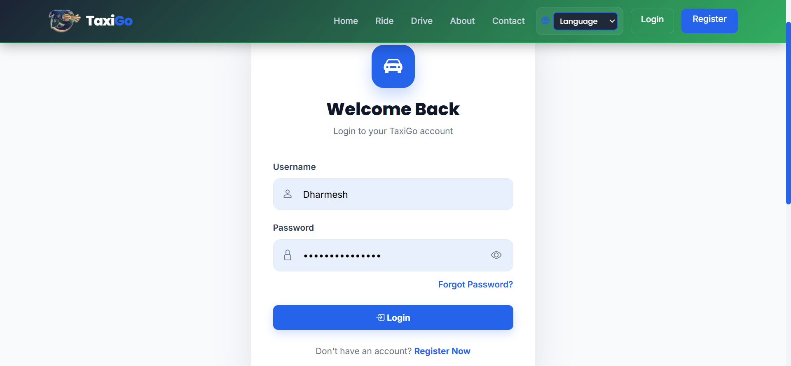
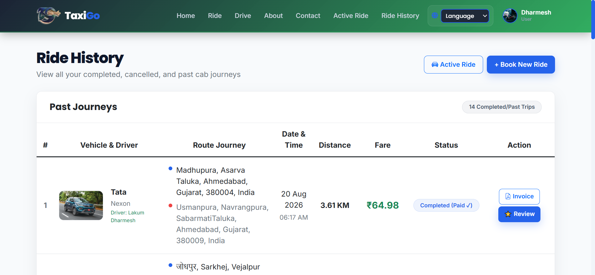
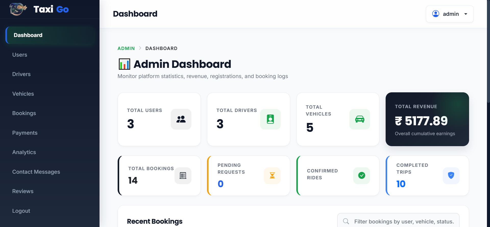
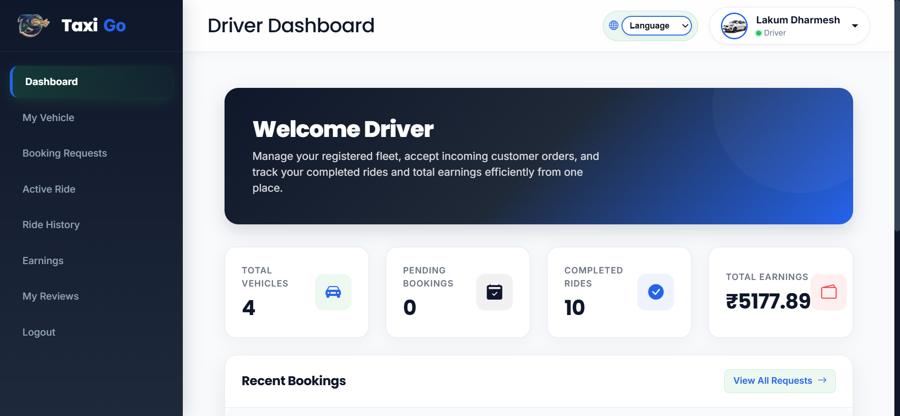

# TaxiGo

TaxiGo is a Django-based web application for taxi booking, ride management, dynamic fare estimation, driver dispatching, and administrative oversight.

## Project Features

- User registration, authentication, and Email OTP verification
- Profile management and driver onboarding portal
- Real-time taxi search and category-based vehicle listing
- Interactive map pick-up and drop-off selection using OpenStreetMap & Leaflet.js
- Live route distance calculation via OpenRouteService API
- Automatic fare calculation based on ride distance and vehicle type
- Secure online payment integration with Razorpay
- User trip booking management, cancellation, and ride ratings/reviews
- Driver dashboard for managing booking requests, active trips, and vehicle specs
- Staff & Admin dashboard for user, driver, vehicle, and booking administration

## Setup Commands

### Clone Repository

```bash
git clone https://github.com/dharmesh1511/TexiGo.git
cd texibooking
```

### Installation on macOS/Linux

```bash
# Create and activate virtual environment
python3 -m venv venv
source venv/bin/activate

# Install dependencies
pip install -r requirements.txt

# Create environment file
cp .env.example .env

# Run database migrations
python manage.py makemigrations
python manage.py migrate

# Create administrator account
python manage.py createsuperuser

# Start development server
python manage.py runserver
```

### Installation on Windows

```powershell
# Create and activate virtual environment
python -m venv venv
venv\Scripts\activate

# Install dependencies
pip install -r requirements.txt

# Create environment file
Copy-Item .env.example .env

# Run database migrations
python manage.py makemigrations
python manage.py migrate

# Create administrator account
python manage.py createsuperuser

# Start development server
python manage.py runserver
```

## LocalServer
http://127.0.0.1:8000/

## credentials

User:- admin<br>
Email:- admin@gmail.com<br>
Password:- admin

## Screenshots









